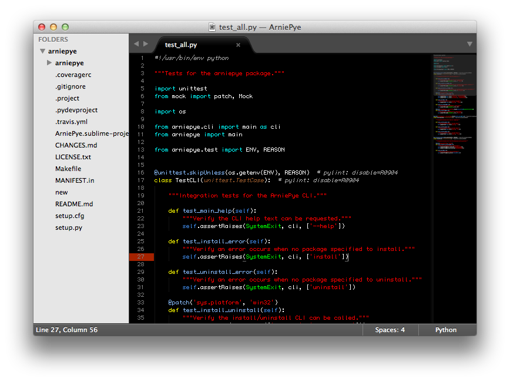

# Midnight Theme

Dark, High-Contrast syntax theme for Sublime Text 2.

## Installation

If you are a git user, the best way to install the theme and keep up to date is to clone the repo directly into your `Packages` directory in the Sublime Text 2 application settings area.

### Using Git

Go to your Sublime Text 2 `Packages` directory and clone the theme repository using the command below:

    git clone https://github.com/joshfriend/Midnight.git

### Download Manually

* Download the files using the GitHub .zip download option
* Unzip the files and rename the folder to `Midnight`
* Copy the folder to your Sublime Text 2 `Packages` directory

## Activating the theme

To configure Sublime Text 2 to use the theme:

* For Sublime Text 2 (Build 2174) and later - Open your User Settings Preferences file `Preferences -> Settings - User`.
* Add (or update) your theme entry to be `"color_scheme": "Packages/Midnight/Midnight.tmTheme"`

### Example User Settings

    {
        "color_scheme": "Packages/Midnight/Midnight.tmTheme"
    }
